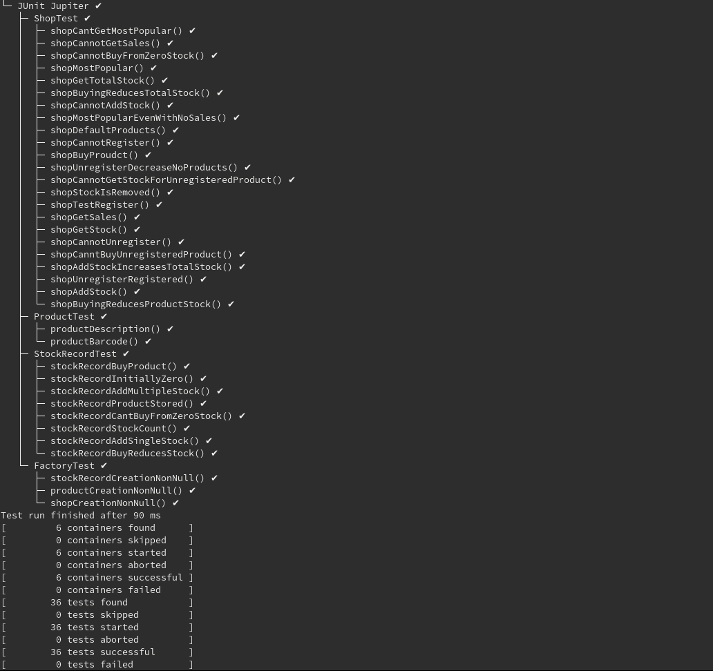

# W05 Practical Report

## Overview

The specification has required that Test-Driven Development be used to implement a selection of interfaces which have been provided. Suitable tests much be write which test the functionality of the implementation of the interfaces. Only areas with `//TODO` comments are to be implemented, but it is assumed that additional methods can be added to add the development of the implemented classes. it is also assumed that all the tests must appear in the 1 test class that exists. Interfaces are not to be changed. Test cases to be implemented:

* Normal : Expected input.
* Edge Case (or Extreme) : empty collections, duplicate bar codes, no stock.
* Exceptional cases: dealing with null values.

## Design

### `IFactory`

It can be seen for the specification that to implement this class fully all that is required is that the methods return objects which implement the interface of the return of the methods.

### `IProduct`

To implement this method all that is required is some way to store a barcode assumed to be string and description which is also a string for the object. It has been defined that if two products have the same barcode and same description then they must be the same object. So essential `equals()` must be override to implement the objects to check if two objects are the same. 

### `IStockRecord`

To fully implement this interface; there must be a method of storing the `IProduct` that this stock record is for, a way to store and get the total stock count, get the number of sales which have occurred, add stock (assumed only 1 added at a time) and buy products (assumed only 1 bought at a time). It can also be seen that when an attempt to buy a product when there is no stock an exception is thrown so a way to determine if there is no stock and throw this exception must be made.

### `IShop`

To fully implement this interface;

* There must be a method which registers product; 
  * so when this method is called the total stock count must increase by 1.
  * Also this method must throw an exception if a product with the same bar code is attempted to be added.
* There must be a method which removes registered products; 
  * so if a product is not registered an exception must be thrown.
  * Shall decrease the total number of products by 1.
  * All of its stock shall be removes from the total stock.
* Must be able to add stock for a specific product barcode
  * cannot add stock if the product bar code is not registered
  * increases the total stock of the product
  * increases the total stock of the shop
* Must be able to buy able to buy products which are registered;
  * cannot buy from unregistered product
  * buying increases the amount of sales for that product in their stock record
  * buying decreases amount of total stock
  * buying decreases the amount of stock for that specific product
* Gets the total amount of products
* gets the total amount of stock
* gets the stock count of a specific product
  * cannot get the stock count of an unregistered product.
* Gets the total amount of sales for a specific product.
  * cannot get the amount of sales for an unregistered product.
* gets the most popular product
  * always returns a product regardless of the amount of sales
  * returns the product with the most sales
  * returns exception if there are no registered products

## TDD

These are sets of tests which were created to resolve if a given method fulfils its desired functionality. These tests will determine if the interfaces have been correctly interfaces as the check if the required functionality and conclusions drawn from effects difference methods must have on each other are seen in the tests.

### `FactoryTest`

This class was designed to Test the factory method. Only methods present in the `IFactory`  interface were tested.  Essential the point of the factory here is to return object which implements the given interface so tests were created to see if factory completed its function.

#### `productCreationNonNull`

Checks that the factory returns an `IProduct` object which implements the interface and not null.

#### `stockRecordCreationNonNull`

Checks that factory returns an `IStockRecord` object which implements the interface and not null.

#### `shopCreationNonNull`

Checks that the creation of a shop is an `IShop` object which implements the interface and not null.

### `ProductTest`

This class class was designed to Test the factory method. Only methods present in the `IProduct` interface will be tested.

#### `productBarcode`

Tests that when a product is created that its bar code can be retrieved from the object.

#### `productDescription`

Tests that when a product is created that its description can be retrieved from the object.

#### `productEquals`

Tests if the `.equals()` method has been over written for the product implementation being used.

### `StockRecord`

#### `createStockStockCount`

Checks if you are able to run Stock Count

#### `stockRecordInitallyZero`

Checks that the initial stock is zero.

#### `stockRecordAddSingleStock`

Checks that the amount of stock is incremented when the `addStock()` method is called

#### `stocRecordAddMultipleStock`

Checks that the amount of increments works for add more than one items to. Further checking if the `addStock()` works properly. 

#### `StockRecordBuyProduct`

Checks you are able to actually buy a product.

#### `stockRecordBuyRecducesStock`

Checks when a product is bought that stock is decreased.

#### `stockRecordBuyIncreasesSales`

Checks that the number of sales is incremented when a `buyProduct()` is calleld

#### `stockRecordCantBuyFromZeroStock`

Checks that an exception is called when an attempt to `buyProduct()` if current stock is 0.

#### `stockRecordProductStored`

Checks that the object is stored in the `stockRecord` object.

### `StockRecord`

These tests functionality can be seen from the JUnit tests.

## JUnit Tests Output

 

## Independence

The tests performed aren't really independent as a lot them assume the full functionality of another aspect. For example if we want to determine if we can actually buy a product we must determine if we are able to call the method. This just tells us we are able to run that method not that a product is bought. We determine that it works through testing if the total stock and product stock decreases and the sales increases. So it depends on the functionality of `TotalStock` and `getStockCount` to show that it actually functions. So the test are necessarily independent. 

## Ambiguities

* Unregistered a product is checking just the bar code enough. Do they have to be the same object or just have the same name and description. So a redefinition of equals for products was designed for this implementation where the only definition of two objects being equals is if there description and bar code are the same.

* Assumes that most popular must just return an object with the highest number of sales. Not necessarily every object with the highest number of sales. e.g. if there is a only 1 registered object with zero sales it shall be returned as the object with the most popularity.

## Conclusion

Through Test Driven Development a set of pre-written interfaces were implement by developing tests which their methods would have to fulfil and then creating classes which actually fulfils that functionality.